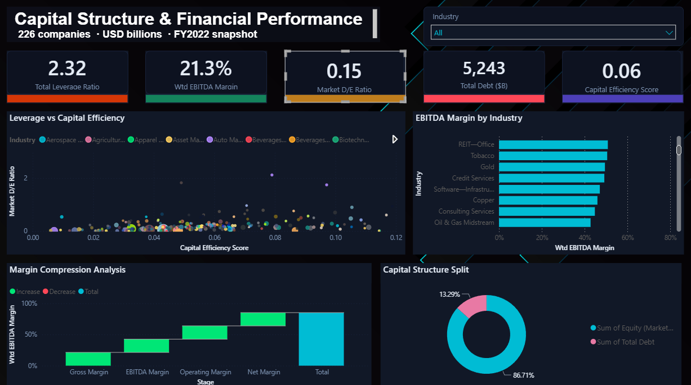

# Capital Structure and Financial Performance Dashboard

An interactive Power BI dashboard that analyses the capital structure, leverage, and profitability of 226 large-cap companies. It gives finance teams and analysts a fast way to see which companies are financed efficiently and which carry heavy debt relative to what they earn.



## What the Project Does

Every company is funded by a mix of debt and equity. Debt is money borrowed from lenders, equity is money from shareholders. The proportion between the two affects how risky a company is and how much it pays to operate. Comparing that mix across a large group of companies is difficult when the data sits in a spreadsheet with dozens of columns per company. This dashboard turns that flat file into a single view where the relationship between leverage and profitability is visible at a glance.

## The Metrics Explained

The dashboard uses finance terms, so here is what each number means in plain language.

**Total Leverage Ratio (2.32x).** Total debt divided by yearly operating earnings. It tells you roughly how many years of earnings it would take to pay off all the debt. A company earning 50,000 a year that owes 116,000 sits at 2.32x. Anything under 3x is generally considered comfortable.

**Weighted EBITDA Margin (21.3%).** Out of every 100 in sales, about 21 is left as operating profit before interest, tax, and accounting deductions. Larger companies carry more weight in the figure, so it reflects the profitability of the whole group rather than treating a small firm the same as a giant one.

**Market Debt-to-Equity Ratio (0.15).** For every dollar of shareholder value the stock market assigns, there is only 15 cents of debt. A number this low means these companies are funded mostly by their owners rather than by borrowing, which lenders read as a sign of safety.

**Total Debt (5,243).** The combined debt of all 226 companies, expressed in billions. That works out to roughly 5.24 trillion dollars, and it simply shows the scale of borrowing across the dataset.

**Capital Efficiency Score (0.06).** For every dollar of total capital put into a business, whether from debt or equity, it produces about 6 cents of operating profit a year. It measures how productively a company uses the money it has.

## The Charts

**Leverage vs Capital Efficiency.** A scatter plot where each bubble is one company. It shows how much debt a company carries against how efficiently it uses its capital, with bubble size representing company value. It makes clusters and outliers easy to spot.

**EBITDA Margin by Industry.** A ranked bar chart of the most to least profitable sectors. Asset-light industries such as software and credit services tend to sit at the top, while capital-heavy industries fall lower.

**Margin Compression Analysis.** A waterfall chart tracing profit from gross margin down to net margin. The drop between EBITDA and net margin is driven largely by interest on debt and depreciation, which links profitability back to capital structure.

**Capital Structure Split.** A donut chart showing the combined debt-versus-equity split of all 226 companies, roughly 87 percent equity and 13 percent debt at market value.

## Data Architecture

The raw flat file was restructured into a star schema for efficient querying.

- **FactCompanyMetrics** holds one row per company with all numeric values: debt, revenue, market cap, margins, and ratios.
- **DimCompany** holds company names, tickers, and data-quality flags.
- **DimIndustry** holds the list of sectors, joined to the fact table by key.
- **MarginStages** is a small helper table that controls the order of the waterfall chart.

## DAX Measures

Five measures drive the dashboard. Each division is wrapped in `DIVIDE()` so it returns a blank instead of an error when a denominator is zero.

```dax
Total Leverage Ratio =
DIVIDE( SUM(FactCompanyMetrics[totalDebt_USDmm]),
        SUM(FactCompanyMetrics[ebitda_USDmm]), BLANK() )

Market D/E Ratio =
DIVIDE( SUM(FactCompanyMetrics[totalDebt_USDmm]),
        SUM(FactCompanyMetrics[marketCap_USDmm]), BLANK() )

Wtd EBITDA Margin =
DIVIDE( SUMX(FactCompanyMetrics,
             FactCompanyMetrics[ebitdaMargins] * FactCompanyMetrics[totalRevenue_USDmm]),
        SUM(FactCompanyMetrics[totalRevenue_USDmm]), BLANK() )

Capital Efficiency Score =
DIVIDE( SUM(FactCompanyMetrics[ebitda_USDmm]),
        SUM(FactCompanyMetrics[totalDebt_USDmm]) + SUM(FactCompanyMetrics[marketCap_USDmm]), BLANK() )

Total Debt ($B) =
SUM(FactCompanyMetrics[totalDebt_USDmm]) / 1000
```

## Tools

| Stage | Tool | What was done |
|---|---|---|
| Data cleaning | Python (pandas) | Handled missing values, standardised currency to millions, flagged negative-equity and incomplete-data rows |
| Data modelling | Power Query (M) | Split the flat file into a star schema of fact and dimension tables |
| Calculations | DAX | Built the five measures for leverage, margins, and efficiency |
| Visualisation | Power BI | Designed the dashboard with a custom dark theme |

The full record of cleaning decisions is in `data_cleaning_log.md`.

## How to Open

1. Download `Finance_dashboard.pbix`.
2. Open it in Power BI Desktop, which is free from Microsoft.
3. Keep `financialdata_cleaned.xlsx` in the same folder so the data source resolves.

## Repository Contents

```
capital-structure-dashboard/
  README.md                      This file
  Finance_dashboard.pbix         The Power BI dashboard
  financialdata_cleaned.xlsx     Cleaned source dataset
  dashboard-preview.png          Dashboard screenshot
  data_cleaning_log.md           Record of cleaning decisions
  ModernFinanceDark_Theme.json   Power BI theme file
```
